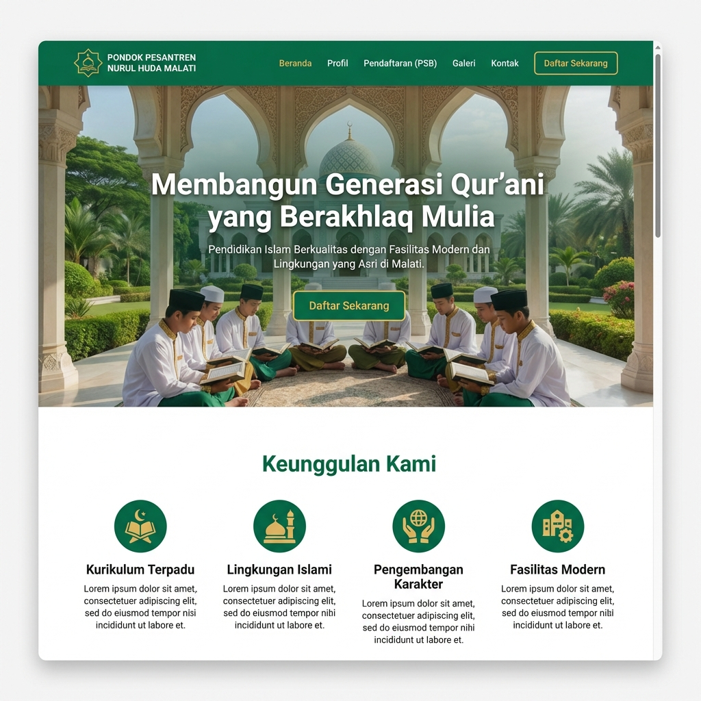

# Laporan Proyek Multimedia Edukatif: Website Pondok Pesantren Nurul Huda Malati

## a. Tahapan Perancangan Proyek Multimedia

Pengembangan aplikasi multimedia edukatif (dalam hal ini Website Pondok Pesantren) mengikuti model pengembangan **MDLC (Multimedia Development Life Cycle)** yang terdiri dari 6 tahapan utama:

1.  **Concept (Pengonsepan)**
    *   **Aktivitas**: Menentukan tujuan aplikasi (informasi & pendaftaran), identifikasi audiens (wali santri & calon santri), dan jenis aplikasi (Web Based Multimedia).
2.  **Design (Perancangan)**
    *   **Aktivitas**: Membuat spesifikasi rinci mengenai arsitektur program, gaya visual (tema warna Navy & Gold), storyboard, dan navigasi (Sitemap).
3.  **Material Collecting (Pengumpulan Bahan)**
    *   **Aktivitas**: Mengumpulkan materi konten seperti teks profil pondok, foto kegiatan, video profil ustadz, dan aset grafis (logo, ikon).
4.  **Assembly (Pembuatan)**
    *   **Aktivitas**: Tahap pemrograman (coding) menggunakan React & Tailwind CSS, integrasi aset multimedia ke dalam komponen website, dan penyusunan layout.
5.  **Testing (Pengujian)**
    *   **Aktivitas**: Melakukan pengujian fungsional (form pendaftaran), kompatibilitas browser, dan responsivitas mobile.
6.  **Distribution (Distribusi)**
    *   **Aktivitas**: Upload ke hosting (Deployment), setup domain, dan publikasi ke pengguna.

---

## b. Identifikasi Kebutuhan dan Analisis Pengguna

Berdasarkan observasi terhadap karakteristik target pengguna Pondok Pesantren:

### Profil Pengguna
1.  **Wali Santri/Orang Tua (Usia 30-55 tahun)**
    *   Karakteristik: Mengutamakan kejelasan informasi, kepercayaan, dan kemudahan akses. Tingkat literasi teknologi menengah.
2.  **Calon Santri (Usia 12-18 tahun)**
    *   Karakteristik: Tertarik pada visual yang menarik, fasilitas, dan ekstrakurikuler. Mobile-first user.

### Laporan Kebutuhan Sistem
1.  **Kebutuhan Fungsional**:
    *   Sistem Pendaftaran Santri Baru (PSB) Online yang mudah diisi.
    *   Galeri Multimedia (Video/Foto) untuk membangun kepercayaan.
    *   Informasi Akademik dan Kurikulum yang transparan.
    *   Kontak cepat (WhatsApp link).
2.  **Kebutuhan Non-Fungsional**:
    *   **Responsif**: Harus bisa diakses dengan baik di Smartphone.
    *   **Aestetik**: Desain "Premium & Islami" untuk citra kredibilitas.
    *   **Performance**: Loading cepat (< 3 detik).

---

## c. Desain Konten dan Antarmuka

### Struktur Konten (Sitemap)
*   **Beranda (Home)**: Hero banner, Sambutan pimpinan, Keunggulan (Card), Berita Terbaru, Footer.
*   **Tentang Kami**: Sejarah, Visi Misi, Struktur Organisasi.
*   **Pendidikan**: Jenjang pendidikan (SMP/SMA), Kurikulum, Ekstrakurikuler.
*   **Pendaftaran (PSB)**: Informasi alur pendaftaran, Form Pendaftaran Online, Cek Status.
*   **Galeri**: Dokumentasi kegiatan (Foto & Video).
*   **Kontak**: Peta lokasi, Form email, info kontak.

### Desain Antarmuka (Mockup)

Desain dirancang dengan nuansa modern menggunakan palet warna **Navy Blue (#0A2342)** untuk kesan profesional/akademis dan **Gold (#f2b90d)** untuk kesan premium/islami.

**Fitur Utama pada Antarmuka:**
1.  **Navbar Sticky**: Memudahkan navigasi cepat ke halaman Pendaftaran.
2.  **Hero Section Imersif**: Menampilkan foto/video suasana pondok dengan tagline inspiratif.
3.  **Card Section**: Untuk berita dan fitur unggulan agar mudah dibaca (skim-friendly).

*(Gambar mockup telah digenerate dan disimpan di root direktori proyek)*

---

## d. Pemilihan Teknologi dan Alat Pengembangan

Berikut adalah komparasi tools yang dipertimbangkan untuk pengembangan proyek ini:

### Tabel Komparasi Tools
| Kategori | Tools A (Terpilih) | Tools B (Alternatif) | Alasan Memilih A |
| :--- | :--- | :--- | :--- |
| **Framework** | **React + Vite** | Wordpress / CMS | React lebih fleksibel, performa tinggi, dan kontrol penuh terhadap interaksi (interactivity). |
| **Styling** | **Tailwind CSS** | Bootstrap / Native CSS | Pengembangan UI lebih cepat dan custom design lebih mudah dibuat modern. |
| **Bahasa** | **TypeScript** | JavaScript / PHP | Type-safety mengurangi bug saat pengembangan fitur kompleks (seperti form PSB). |
| **Code Editor**| **VS Code** | Sublime Text | Ekosistem ekstensi yang lengkap untuk TypeScript dan React. |
| **Design** | **Figma** | Adobe XD | Kolaborasi mudah dan standar industri saat ini (meski untuk draft kita gunakan AI generation). |

### Keputusan Pilihan Tools
Diputuskan menggunakan **React (Vite) + Tailwind CSS** dengan bahasa **TypeScript**.
*   **Alasan**: Website membutuhkan interaktivitas tinggi (terutama di form pendaftaran dan galeri multimedia). Teknologi ini memungkinkan pembuatan *Single Page Application* (SPA) yang terasa cepat dan "app-like" bagi pengguna mobile, sesuai analisis kebutuhan pengguna muda (calon santri).

---

## e. Evaluasi, Pengujian, dan Dokumentasi

### Rencana Evaluasi dan Pengujian
1.  **Black Box Testing**:
    *   Menguji fitur input form pendaftaran (validasi email, nomor HP).
    *   Menguji navigasi menu (broken link check).
2.  **User Acceptance Testing (UAT)**:
    *   Meminta 3-5 orang (perwakilan wali santri) untuk mencoba mendaftar.
    *   Metode: "Think Aloud" (pengguna menyuarakan apa yang mereka pikirkan saat menggunakan web).
3.  **Performance Testing**:
    *   Menggunakan Lighthouse (Google Chrome) untuk cek skor SEO dan Aksesibilitas.

### Struktur Dokumentasi Akhir
Dokumen akhir proyek akan terdiri dari:
1.  **User Manual (Panduan Pengguna)**:
    *   Langkah-langkah pendaftararan online.
    *   Cara mengakses informasi kelulusan.
2.  **Technical Documentation (Dokumen Teknis)**:
    *   Struktur folder proyek.
    *   Cara instalasi dan run server (README.md).
    *   Penjelasan komponen utama (misal: `RegistrationForm.tsx`).
3.  **Laporan Maintenance**:
    *   Jadwal backup data.
    *   Kontak support developer.
